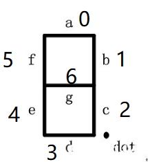
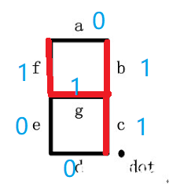
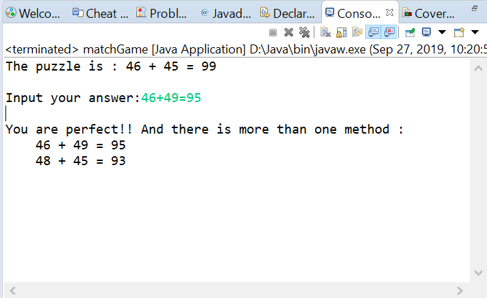
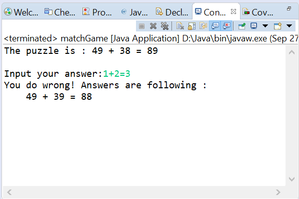
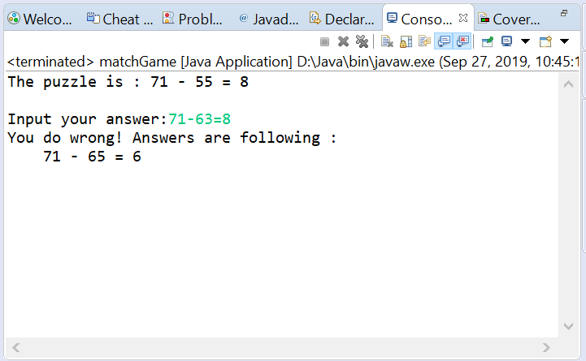
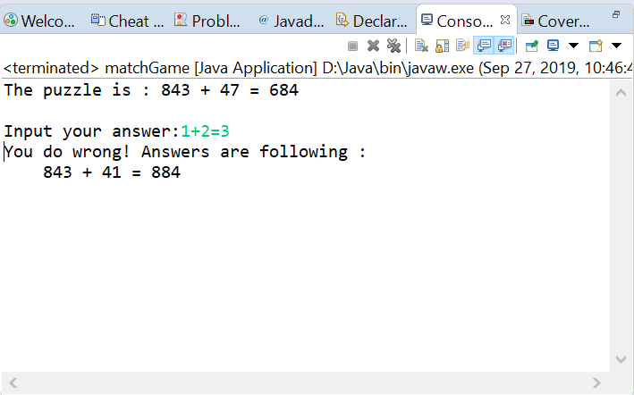

# 移动火柴游戏

## 问题描述 ##

移动火柴棍是一个经典的数学游戏，游戏中0-9的数字型状是固定的，游戏的目标是移动一个火柴棍使得原式成立。游戏的解法可能有多种。在本程序中，我们暂时不考虑符号的改变而仅考察数字的变化。对于多解问题，玩家给出一个正确解答即可。

## 算法设计 ##

在这个游戏中，一个数字每个位置火柴棍的摆放只有‘有’或者‘无’两种可能，因此我们总可以用一个七位二进制数来表示0-9。我们用下面的七位数码管来代替火柴棍具体说明。



一个七位数码管的位置分别用如图所示的数字表示，数字又对应了在七位二进制数中的位置（从左到右）；若该位置二进制数位1，则表示该处存在一个火柴棍，否则没有。例如数字 “4，对应的七位二进制数即为 “0110011”。将等式的数字转换为七位二进制数，那么移动一根火柴的问题就变成了如何从一个七位二进制数中减少一个1，并添加到另一个七位二进制数中，并使得等式成立。

显然这个问题的规模较小，我采用穷举法来求出问题的解。首先由程序随机生成三个数，分别是两个加数一个和数，然后将这些数字转换为多个七位二进制数；然后遍历这些由多个七位二进制数组成的数组，寻找能够移动的“火柴”。“火柴”要移动需要满足以下两个条件：
- 此位置有火柴，即数组当前位置的值为1
- 此“火柴”移走后，剩余火柴仍能组成数字

当我们找到能够移动的“火柴”时，我们继续遍历二进制数组，寻找能够接受“火柴”的空位。空位要接受火柴需要满足以下两个条件：
- 此位置无火柴，即数组当前位置的值为0
- “火柴”移入后，新火柴能组成数字

同时找到可移动的"火柴"和“空位”后，程序将得到两个新的加数和一个新的和数，然后进一步验证这个新的等式是否成立，成立则将其添加到解答列表中。如果程序始终找不到一个不等式的解，那么它将重新生成一组新的不等式直至找到一组有解的不等式。可以保证的是，整个过程的时间复杂度完全可控，程序可以顺利执行。

题目的难度设置可以通过随机数的大小调整来实现。事实上，移动两根、三根火柴的游戏也同样可以通过这个算法来实现。由于时间关系，在本程序中仅涉及一根火柴的移动。

## 功能展示 ##

当玩家给出正确解答

 <br>

当玩家给出错误解答

 <br>

题目随机生成

 <br>

设置题目难度

 <br>

## 附录 ##

```java
import java.util.Arrays;
import java.util.Vector;
import java.util.Scanner;

public class matchGame {

	int match_shapes[][] = {
			{1, 1, 1, 1, 1, 1, 0},
			{0, 1, 1, 0, 0, 0, 0},
			{1, 1, 0, 1, 1, 0, 1},
			{1, 1, 1, 1, 0, 0, 1},
			{0, 1, 1, 0, 0, 1, 1},
			{1, 0, 1, 1, 0, 1, 1},
			{1, 0, 1, 1, 1, 1, 1},
			{1, 1, 1, 0, 0, 0, 0},
			{1, 1, 1, 1, 1, 1, 1},
			{1, 1, 1, 1, 0, 1, 1}
		};
	int x, y, z;
	int flag;
	public Vector<Integer> ansX, ansY;
	
	public matchGame(int x, int y, int z,int flag) {
		this.x = x;
		this.y = y;
		this.z = z;
		this.flag = flag;
		ansX = new Vector<Integer>();
		ansY = new Vector<Integer>();
	}
	
	public int[][] num2match(int num) {
		int [] bit = new int[4];
		int index = 0;
		while (num > 0) {
			bit[index] = num % 10;
			num = num / 10;
			index++;
		}		
		int [][] matches = new int[index][7];
		for (int i = index-1;i >= 0;i--)
			for (int j = 0;j < 7;j++)
				matches[index-1-i][j] = match_shapes[bit[i]][j];
		return matches;
	}
	
	public int match2num(int[][] match) {
		int num = 0;
		for (int i = 0;i < match.length;i++)
		{
			for (int j = 0;j < 10;j++)
				if (Arrays.equals(match[i],match_shapes[j])) {
					num = num * 10;
					num += j;
				}
		}

		return num;
	}
	
	public boolean isDigit(int[] match) {
		for (int i = 0;i < 10;i++)
			if (Arrays.equals(match, match_shapes[i]))
				return true;
		return false;
	}
	
	public boolean isMovable(int index, int[] match) {
		match[index] = 0;
		boolean flag = isDigit(match);
		match[index] = 1;
		return flag;
	}
	
	public boolean isAcceptable(int index, int[] match) {
		match[index] = 1;
		boolean flag = isDigit(match);
		match[index] = 0;
		return flag;
	}
	
	public void printPlus(int[][] match) {
		for (int i=0;i<match.length;i++)
			for (int j=0;j<7;j++)
				System.out.printf("%d",match[i][j]);
		System.out.println();
	}
	
	public boolean isSolved() {
		boolean issolved = false;
		int[][] plusA = num2match(x);
		int[][] plusB = num2match(y);
		int[][] sum = num2match(z);
		
		int digitlen = plusA.length+plusB.length+sum.length;
		int[][] digits = new int[digitlen][7];
		for (int i = 0;i < plusA.length;i++)
			digits[i] = plusA[i]; 
		for (int i = 0;i < plusB.length;i++)
			digits[i+plusA.length] = plusB[i];
		for (int i = 0;i < sum.length;i++)
			digits[i+plusA.length+plusB.length] = sum[i];
		
		for (int i = 0;i < digitlen;i++) {
			for (int ii = 0;ii < 7;ii++) {
				if (digits[i][ii] == 1 && isMovable(ii, digits[i])) {
					for (int j = 0;j < digitlen;j++) {
						if (i == j) continue;
						for(int jj = 0;jj < 7;jj++) {
							if (digits[j][jj] == 0 && isAcceptable(jj, digits[j])) {
								digits[i][ii] = 0;
								digits[j][jj] = 1;
								int xc = match2num(Arrays.copyOfRange(digits,0, \
									plusA.length));
								int yc = match2num(Arrays.copyOfRange(digits, plusA.length, \
									plusB.length+plusA.length));
								int sumc = match2num(Arrays.copyOfRange(digits, plusA.length\
									+plusB.length, plusB.length\
									+plusA.length+sum.length));
								digits[i][ii] = 1;
								digits[j][jj] = 0;
								if (flag == 1 && xc + yc == sumc) {
									ansX.add(xc);
									ansY.add(yc);
									issolved = true;
								} 
								else if (flag == 0 && xc - yc == sumc) {
									ansX.add(xc);
									ansY.add(yc);
									issolved = true;
								} 
							}
						}
					}
				}
			}
		}
		return issolved;
	}
			
	public static void main(String[] args) {
		boolean flag = false;
		matchGame M;
		int a,b,c;
		
		int MAX = 99;
		int MODE = 1;//1 plus,0 minus
		
		while (true) {
			a = 1 + (int)(Math.random() * MAX);
			b = 1 + (int)(Math.random() * MAX);
			c = 1 + (int)(Math.random() * MAX);
			if (MODE == 0 && a < b) continue;
			M = new matchGame(a, b, c, MODE);
			flag = M.isSolved();
			if (flag) break;
		}
		
		System.out.printf("The puzzle is : %d + %d = %d\n\n", a, b, c);
		System.out.printf("Input your answer:");
		Scanner sc = new Scanner(System.in);
		String equal = sc.nextLine().replace(" ", "");
		
		int[] vals = new int[3];
		int index = 0;
        for (String retval: equal.split("\\+|-|=")){
        	try {
        		vals[index] = Integer.parseInt(retval);
        		index++;
        	}
        	catch (Exception e){
        		System.out.println("Exception thrown  :" + e);
        	}
        }
        
        if (index != 3) 
        	throw new UnsupportedOperationException();
        else {
        	flag = false;
        	for (int i = 0;i < M.ansX.size();i++)
        		if (M.ansX.get(i) == vals[0] && M.ansY.get(i) == vals[1]) {
        			flag = true;
        			if (M.ansX.size() > 1) {
                        System.out.println("\nYou are perfect!! And there is more than one method :");
                		for (int j = 0;j < M.ansX.size();j++)
                			System.out.printf("    %d + %d = %d\n", M.ansX.get(j),\
						 M.ansY.get(j), M.ansX.get(j)+M.ansY.get(j));
        			}
        			break;
        		}
        	if (!flag) {
                System.out.println("You do wrong! Answers are following :");
        		for (int i = 0;i < M.ansX.size();i++)
        			System.out.printf("    %d + %d = %d\n", M.ansX.get(i), 
						M.ansY.get(i), M.ansX.get(i)+M.ansY.get(i));
        	}

        }

	}

}

```